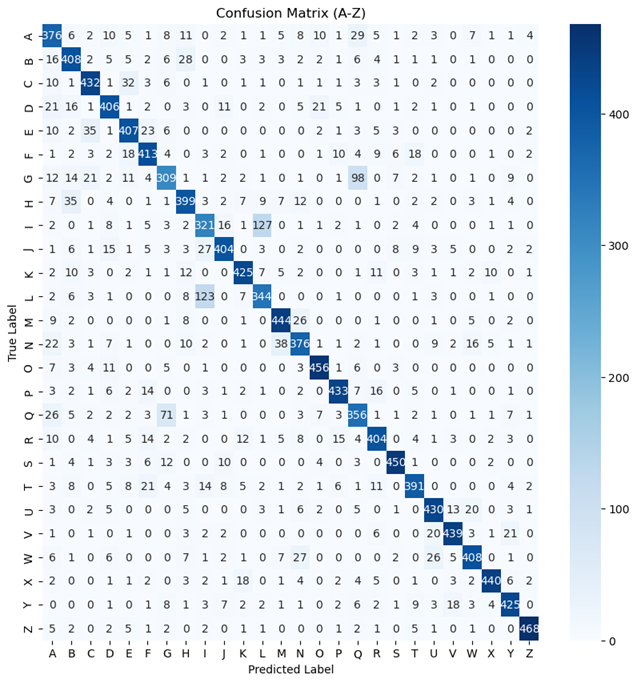

# 📝 Handwritten Letter Recognition using HOG and SVM  

This project focuses on classifying handwritten letters (A–Z) from the **EMNIST Letters** dataset using **Histogram of Oriented Gradients (HOG)** for feature extraction and **Support Vector Machine (SVM)** for classification.  

---

## 📂 Dataset  
The dataset used is **EMNIST Letters**, which contains grayscale images of handwritten English alphabets (A–Z), each sized **28x28 pixels**.  
- **Training data:** 13,000 samples (500 per class)  
- **Testing data:** 13,000 samples (500 per class)  

Source: [EMNIST Dataset on Kaggle](https://www.kaggle.com/datasets/crawford/emnist)

---

## ⚙️ Project Workflow  

### 1️⃣ Load Dataset  
The EMNIST Letters dataset is loaded using `loadlocal_mnist()` from **mlxtend.data** to read `.ubyte` files.  
```python
from mlxtend.data import loadlocal_mnist
train_images, train_labels = loadlocal_mnist(
    images_path='../emnist_source_files/emnist-letters-train-images-idx3-ubyte',
    labels_path='../emnist_source_files/emnist-letters-train-labels-idx1-ubyte'
)
```

---

### 2️⃣ Feature Extraction (HOG)  
Each image is processed using **Histogram of Oriented Gradients (HOG)** to extract edge and texture features.  
```python
from skimage.feature import hog

feature, hog_img = hog(image.reshape(28, 28),
                       orientations=9,
                       pixels_per_cell=(8, 8),
                       cells_per_block=(2, 2),
                       visualize=True,
                       block_norm='L2-Hys')
```

This converts each image into a vector of numerical features that describe the shape and contour of the handwritten letter.

---

### 3️⃣ Classification using SVM  
An **SVM (Support Vector Machine)** with a linear kernel is trained using the extracted HOG features.  
```python
from sklearn.svm import SVC
clf = SVC(kernel='linear', C=10)
clf.fit(x_train, y_train)
```

Evaluation uses **Leave-One-Out Cross Validation (LOOCV)** to ensure precise performance measurement.

---

### 4️⃣ Evaluation Results  
The model achieves:  
- **Accuracy:** ~81%  
- **Precision / Recall / F1-score:** ~0.81 (on average)

A **confusion matrix** is plotted to visualize the predictions for all 26 classes (A–Z):  



---

### 5️⃣ Visualization of Predictions  
For better understanding, the code also displays several test samples for one selected letter class:  

```python
plt.suptitle(f'Accuracy for Class {target_class}: {accuracy * 100:.2f}%')
```

This helps visualize how accurate the model is for a specific character.

---

## 📊 Example Output  
**Classification Report:**
```
Accuracy: 0.81
Macro avg: 0.81
Weighted avg: 0.81
```

**Confusion Matrix:**
Dark blue diagonal cells show correctly classified letters, while lighter cells indicate misclassifications — often between similar letters such as **‘O’ and ‘Q’** or **‘I’ and ‘L’**.

---

## 💡 Conclusion  
The combination of **HOG feature extraction** and **SVM classifier** works effectively for handwritten letter recognition, reaching about **81% accuracy**.  
Most errors occur between visually similar letters, but overall, the model performs reliably across all 26 classes.

---

## 💡 Program Explanation
For further explanation about the programs contained in this notebook, you can watch the following video : [Watch the video](https://youtu.be/t6u5ZK1mJBI?si=c6xjRMOo9zbcmq4u)


